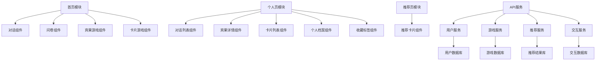
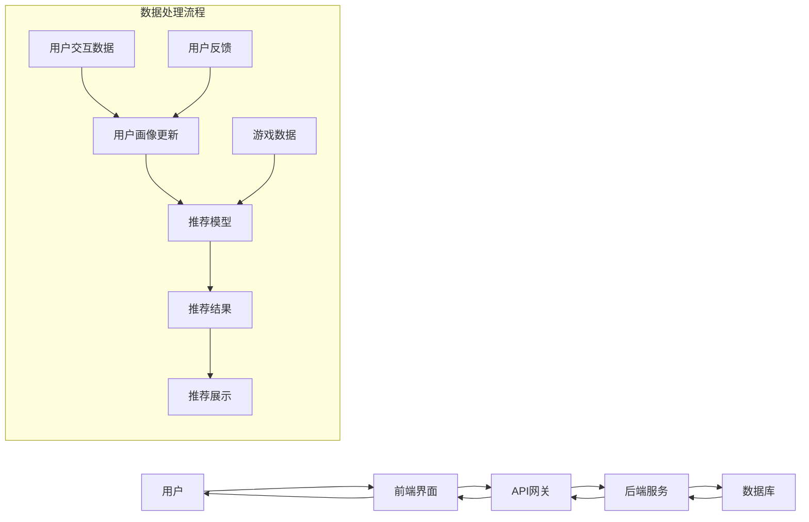

# DESIGN_GAL_RECOMMEND.md

## 整体架构概述

本项目采用前后端分离架构，前端负责用户交互和界面展示，后端负责数据处理和业务逻辑。系统整体分为前端层、API网关层、后端服务层和数据存储层。

## 系统分层设计

```mermaid
layeredGraph
    layer Frontend [label="前端层"] {
        component HomePage [label="首页"]
        component PersonalPage [label="个人页"]
        component RecommendPage [label="推荐页"]
        component CommonComponents [label="通用组件"]
        component UserInterface [label="用户界面"]
    }

    layer APIGateway [label="API网关层"] {
        component AuthService [label="认证服务"]
        component RequestRouter [label="请求路由"]
        component RateLimiter [label="限流控制"]
    }

    layer BackendServices [label="后端服务层"] {
        component UserService [label="用户服务"]
        component GameService [label="游戏服务"]
        component RecommendService [label="推荐服务"]
        component InteractionService [label="交互服务"]
        component AIService [label="AI服务"]
    }

    layer DataStorage [label="数据存储层"] {
        component UserDB [label="用户数据库"]
        component GameDB [label="游戏数据库"]
        component InteractionDB [label="交互数据库"]
        component RecommendDB [label="推荐结果库"]
    }

    Frontend --> APIGateway
    APIGateway --> BackendServices
    BackendServices --> DataStorage
```

## 核心模块设计

### 1. 前端模块

#### 1.1 页面模块
- **首页模块**：包含对话、问卷、游戏三种交互方式的入口和实现
- **个人页模块**：包含对话列表、宾果详情、卡片列表、个人档案和收藏标签五个子页面
- **推荐页模块**：展示个性化游戏推荐列表，支持排序和筛选

#### 1.2 组件模块
- **对话组件**：实现与用户的自然语言交互
- **问卷组件**：展示和收集结构化问卷数据
- **宾果游戏组件**：实现宾果游戏的界面和逻辑
- **卡片游戏组件**：实现卡片选择游戏的界面和逻辑
- **推荐卡片组件**：展示游戏推荐信息
- **导航组件**：实现页面间导航

#### 1.3 服务模块
- **API服务**：封装与后端的API交互
- **状态管理服务**：管理应用全局状态
- **用户服务**：处理用户相关操作
- **推荐服务**：处理推荐相关逻辑

### 2. 后端模块

#### 2.1 用户服务
- 用户注册、登录和认证
- 用户画像构建和更新
- 用户信息管理

#### 2.2 游戏服务
- 游戏信息查询和管理
- 游戏标签和画像管理
- 游戏数据更新

#### 2.3 交互服务
- 对话交互处理
- 问卷数据处理
- 游戏交互数据处理

#### 2.4 推荐服务
- 基于用户画像的游戏召回
- 推荐结果排序
- 推荐模型训练和优化

#### 2.5 AI服务
- 自然语言处理
- 用户偏好分析
- 游戏相似度计算

## 模块依赖关系图



## 接口契约定义

### 1. 用户服务接口
- `POST /api/user/register`：用户注册
- `POST /api/user/login`：用户登录
- `GET /api/user/profile`：获取用户信息
- `PUT /api/user/profile`：更新用户信息
- `GET /api/user/portrait`：获取用户画像

### 2. 游戏服务接口
- `GET /api/game/list`：获取游戏列表
- `GET /api/game/detail/{id}`：获取游戏详情
- `GET /api/game/tags`：获取游戏标签

### 3. 交互服务接口
- `POST /api/interaction/chat`：对话交互
- `POST /api/interaction/questionnaire`：问卷提交
- `POST /api/interaction/bingo`：宾果游戏结果提交
- `POST /api/interaction/card`：卡片游戏结果提交
- `GET /api/interaction/history`：获取交互历史

### 4. 推荐服务接口
- `GET /api/recommend/list`：获取推荐列表
- `GET /api/recommend/detail/{id}`：获取推荐详情
- `POST /api/recommend/feedback`：提交推荐反馈

## 数据流向图



## 异常处理策略

1. **前端异常处理**
   - 页面加载异常：显示友好的错误提示，提供重试按钮
   - API请求异常：捕获并处理HTTP错误，显示对应的错误信息
   - 数据解析异常：使用try-catch处理JSON解析错误
   - 交互操作异常：表单验证，防止无效提交

2. **后端异常处理**
   - 业务逻辑异常：定义清晰的错误码和错误信息
   - 数据库操作异常：事务回滚，记录错误日志
   - API请求异常：统一的异常拦截器，返回标准的错误响应
   - 系统异常：熔断机制，防止级联故障

3. **日志记录策略**
   - 前端日志：记录关键用户操作和错误信息
   - 后端日志：分级别记录系统运行状态、请求响应和错误信息
   - 日志分析：定期分析日志，发现潜在问题

## 设计原则遵循

1. **单一职责原则**：每个模块和组件只负责单一功能
2. **开闭原则**：对扩展开放，对修改关闭
3. **依赖倒置原则**：依赖抽象，不依赖具体实现
4. **接口隔离原则**：接口精简，避免不必要的方法
5. **迪米特法则**：降低模块间耦合，提高内聚
6. **复用性原则**：封装通用组件和服务，提高复用率
7. **性能优化原则**：关注关键路径性能，避免不必要的计算