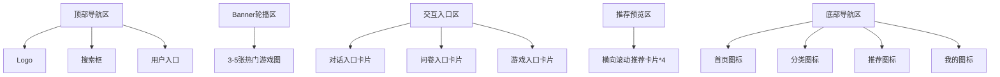
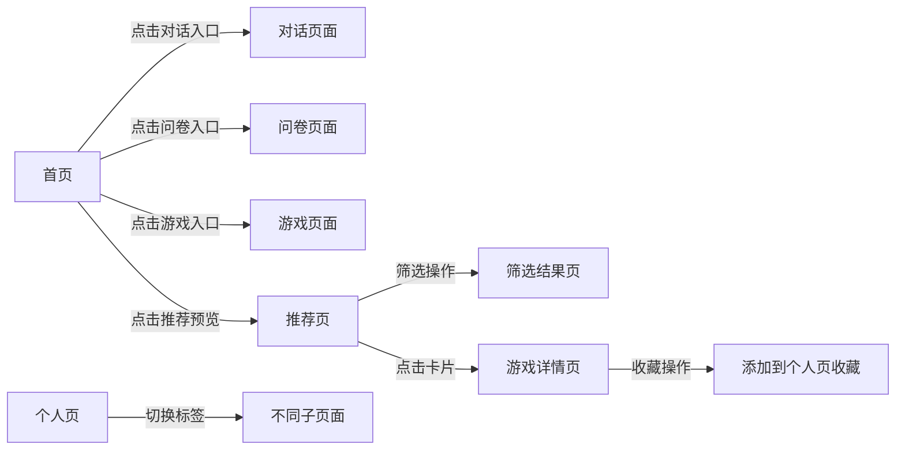

## 设计理念
二次元游戏推荐平台设计系统融合了动漫美学与现代UI设计原则，以年轻化、沉浸式体验为核心。通过鲜明的色彩对比、灵动的视觉元素和流畅的交互反馈，打造符合ACGN文化特质的用户界面。设计语言强调角色化表达、情感化互动和场景化呈现，让游戏推荐过程成为一场二次元文化探索之旅。

## 颜色系统
### 主色调
```scss
$anime-purple: #7B61FF; // 幻想紫 - 主色调，体现二次元奇幻感
$anime-blue: #3E9BFF; // 晴空蓝 - 辅助色，用于交互元素
$anime-pink: #FF6AD5; // 樱花粉 - 强调色，用于重点按钮
$anime-yellow: #FFD166; // 暖阳黄 - 提示色，用于通知和提醒
$anime-green: #06D6A0; // 薄荷绿 - 成功色，用于完成状态
```

### 辅助色
```scss
$secondary-red: #EF476F; // 活力红 - 用于错误提示和强调
$secondary-orange: #FF9F1C; // 活力橙 - 用于新内容标记
$secondary-cyan: #118AB2; // 深海蓝 - 用于次要文本
$secondary-gray: #64748B; // 石板灰 - 用于辅助说明
```

### 中性色
```scss
$neutral-black: #121212; // 夜空黑 - 背景色
$neutral-dark: #1E1E2E; // 暗幕灰 - 卡片背景
$neutral-medium: #333344; // 石板灰 - 边框和分割线
$neutral-light: #E2E8F0; // 雾面白 - 次要文本
$neutral-white: #F8FAFC; // 珍珠白 - 主要文本
```

## 排版系统
### 字体规范
- **标题字体**：`"M PLUS Rounded 1c", sans-serif`（圆润日系风格）
- **正文字体**：`"Noto Sans SC", sans-serif`（清晰易读的无衬线字体）
- **数字字体**：`"Rajdhani", sans-serif`（游戏化数字显示）

### 字号系统
```scss
$font-size-h1: 2.5rem; // 页面主标题
$font-size-h2: 2rem; // 区块标题
$font-size-h3: 1.5rem; // 卡片标题
$font-size-h4: 1.25rem; // 子标题
$font-size-body: 1rem; // 正文内容
$font-size-caption: 0.875rem; // 辅助说明
$font-size-small: 0.75rem; // 标签文本
```

### 字重规范
- 粗体：700（标题、重点文字）
- 常规：400（正文、说明文字）
- 轻量：300（辅助信息、次要文本）

## 组件设计
### 1. 游戏卡片组件
- **尺寸**：宽160px×高240px（移动端），宽220px×高320px（平板/PC）
- **样式**：圆角12px，轻微阴影（0 4px 12px rgba(0,0,0,0.15)）
- **组成元素**：
  - 游戏封面图（16:9比例，圆角8px顶部）
  - 游戏名称（h3，最多2行，溢出省略）
  - 评分标签（右上角悬浮，半透明背景）
  - 类型标签（底部标签栏，最多2个）
  - 悬停效果：轻微上浮（transform: translateY(-4px)）

### 2. 导航组件
- **底部导航**：高度56px，包含4个图标+文字项
- **图标风格**：线性图标，选中状态填充主色调
- **文字**：12px，选中状态加粗
- **交互**：点击时有波纹反馈

### 3. 按钮组件
- **主要按钮**：填充主色调，圆角24px，文字白色
- **次要按钮**：描边样式，主色调边框，圆角24px
- **文本按钮**：无背景，主色调文字，下划线hover效果
- **尺寸**：大(48px高)、中(40px高)、小(32px高)

### 4. 标签组件
- **游戏标签**：圆角16px，背景色neutral-dark，文字neutral-light
- **新游标签**：圆角16px，背景色secondary-orange，文字白色
- **热门标签**：圆角16px，背景色anime-pink，文字白色
- **尺寸**：高度28px，内边距水平12px

## 布局系统
### 1. 页面布局
- **移动端**：单列流式布局，padding: 16px
- **平板/PC**：多列网格布局，max-width: 1200px，居中对齐

### 2. 区块结构
- **顶部区域**：导航栏(56px高) + Banner轮播(16:9比例)
- **内容区域**：
  - 分类导航(横向滚动)
  - 推荐游戏区(2-3列网格)
  - 新游预约区(列表布局)
  - 专题活动区(卡片轮播)
- **底部区域**：版权信息 + 链接组

### 3. 响应式规则
- **移动端** (<768px)：2列游戏卡片，垂直排列
- **平板** (768px-1024px)：3列游戏卡片，适当增大间距
- **PC端** (>1024px)：4列游戏卡片，固定宽度容器

## 交互设计
### 1. 微交互
- **卡片悬停**：缩放1.03倍，阴影增强
- **按钮点击**：轻微缩小(0.98倍)后恢复
- **页面切换**：横向滑动过渡(300ms)
- **加载状态**：骨架屏 + 脉冲动画

### 2. 手势操作
- **游戏列表**：上下滑动浏览
- **卡片查看**：点击进入详情，右滑返回
- **分类切换**：横向滑动
- **下拉刷新**：弹性动画效果

### 3. 反馈机制
- **操作成功**：顶部toast提示 + 成功动画
- **加载中**：骨架屏占位
- **空状态**：插画+引导文字
- **错误状态**：错误图标+重试按钮

## 图标系统
### 1. 风格规范
- 线性+填充结合的二次元风格图标
- 线条粗细2px，圆角4px
- 色彩遵循主题色系统

### 2. 常用图标
- **首页**：游戏手柄图标
- **分类**：标签图标
- **推荐**：星星图标
- **我的**：用户头像图标
- **搜索**：放大镜图标（二次元化设计）

## 设计资源
### 1. 资源链接
- 图标库：[二次元游戏图标集](https://example.com/icons)
- 插画素材：[游戏场景插画库](https://example.com/illustrations)
- 字体下载：[推荐字体包](https://example.com/fonts)

### 2. 设计工具
- Figma组件库：[二次元游戏UI组件库](https://example.com/figma)
- Sketch资源：[设计资源包](https://example.com/sketch)
## 模块对应设计规范

### 一、页面模块设计细则

#### 1.1 首页模块设计

- **布局比例**：导航区(8%) + Banner区(30%) + 交互入口区(40%) + 推荐预览区(20%) + 底部导航区(8%)
- **交互入口卡片**：采用3宫格布局，每张卡片包含图标(40px)、标题(16px)、简短描述(12px)
- **视觉层次**：交互入口卡片使用悬浮阴影(0 8px 24px rgba(123, 97, 255, 0.2))区分层级

#### 1.2 个人页模块设计
- **布局结构**：
  - 个人档案区(20%)：头像(80px)、用户名(20px)、用户标签(14px)
  - 功能导航区(15%)：横向滚动标签栏(对话/宾果/卡片/收藏)
  - 内容展示区(60%)：根据选中标签动态加载对应内容
  - 底部操作区(5%)：固定操作按钮(编辑资料/设置)

- **子页面设计**：
  - **对话列表**：左图右文布局，头像(50px)、对话摘要(14px)、时间戳(12px)
  - **宾果详情**：网格布局(5x5)，已完成格子半透明处理
  - **卡片列表**：瀑布流布局，每张卡片包含缩略图(120px)、名称(16px)、获取时间(12px)
  - **收藏标签**：流式布局，标签间距8px，点击展开对应游戏列表

#### 1.3 推荐页模块设计
- **顶部筛选区**：
  - 排序选项：下拉选择器(最新/最热/评分)
  - 分类筛选：水平滚动标签(全部/RPG/策略/休闲)
  - 平台筛选：图标按钮组(PC/手游/主机)

- **内容展示区**：
  - 推荐卡片采用2-3列自适应网格
  - 卡片间距：水平16px，垂直24px
  - 分页加载：滚动到底部自动加载下一页(每次8张卡片)

### 二、组件模块设计规范

#### 2.1 核心组件与模块对应关系
| 模块名称 | 包含组件 | 设计规范 |
|---------|---------|---------|
| 首页模块 | 对话组件、问卷组件、游戏组件 | 统一卡片式设计，24px圆角，边框1px渐变 |
| 个人页模块 | 列表组件、标签组件、档案组件 | 扁平化设计，强调信息层级，弱化装饰 |
| 推荐页模块 | 推荐卡片、筛选组件、排序组件 | 突出游戏封面，辅助信息最小化 |

#### 2.2 关键组件详细规范

**对话组件**
- 容器：最大宽度80%，气泡样式(20px圆角)
- 头像：圆形(40px)，居左/居右对齐
- 文本：16px行高1.5，气泡内边距16px
- 输入区：固定底部，包含表情按钮、语音按钮、发送按钮

**问卷组件**
- 标题区：18px加粗，底部16px边距
- 选项区：
  - 单选：圆形选择框(20px) + 文本(16px)
  - 多选：方形选择框(20px) + 文本(16px)
  - 输入框：下划线样式，高度48px，提示文本14px
- 提交区：固定底部，包含上一题/下一题/提交按钮

**宾果游戏组件**
- 游戏区：5x5网格，每个格子60px×60px
- 格子样式：
  - 未选中：白色边框，灰色背景
  - 已选中：主题色边框，半透明填充
  - 完成线：主题色加粗线条(4px)
- 操作区：包含重置按钮、提示按钮、提交按钮

**推荐卡片组件**
```html
<div class="recommend-card">
  
  <div class="tag">热门</div>
  <h3 class="game-title">原神</h3>
  <div class="score">
    <span class="star">★</span>
    <span class="value">4.8</span>
  </div>
</div>
```
- 封面图：16:9比例，顶部20px圆角
- 标签位置：右上角，距离顶部8px，距离右侧8px
- 标题行数：最多2行，溢出显示省略号
- 评分区：星级(18px黄色) + 数字(16px)

### 三、模块间视觉关系

#### 3.1 色彩应用规范
- **首页模块**：主色调(70%) + 辅助色(30%)，高饱和度
- **个人页模块**：中性色(80%) + 主色调(20%)，低饱和度
- **推荐页模块**：游戏封面主色为主，界面元素弱化处理

#### 3.2 导航流转规则


#### 3.3 响应式适配规则
| 设备类型 | 首页模块布局 | 推荐页卡片数 | 字体缩放比例 |
|---------|------------|------------|------------|
| 手机(<768px) | 单列流式 | 2列 | 1.0 |
| 平板(768-1024px) | 双列网格 | 3列 | 1.1 |
| 桌面(>1024px) | 固定宽度 | 4列 | 1.2 |

## 设计验证清单
1. [ ] 所有前端模块均有对应设计规范
2. [ ] 组件设计覆盖文件中定义的全部组件
3. [ ] 布局比例符合内容重要性排序
4. [ ] 交互流程与模块依赖关系一致
5. [ ] 响应式规则覆盖三种设备类型
6. [ ] 色彩应用符合模块功能定位