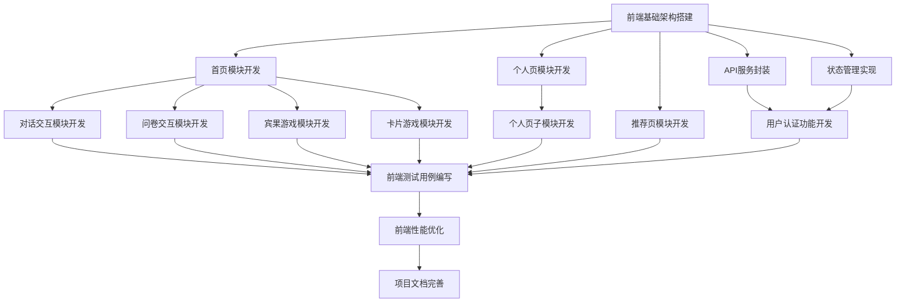

# TASK_GAL_RECOMMEND.md

## 子任务拆分

基于架构设计，将项目拆分为以下原子任务：

### 1. 前端基础架构搭建
- **任务ID**: T001
- **任务名称**: 前端项目初始化
- **输入契约**: 项目需求文档、技术栈选择
- **输出契约**: 初始化的前端项目结构、配置文件
- **实现约束**: 使用Vue.js + UniApp + Vite，遵循项目代码规范
- **依赖关系**: 无前置任务

### 2. 首页模块开发
- **任务ID**: T002
- **任务名称**: 首页布局和导航开发
- **输入契约**: 设计稿、导航需求
- **输出契约**: 首页布局组件、导航组件
- **实现约束**: 响应式设计，适配不同设备
- **依赖关系**: T001

### 3. 对话交互模块开发
- **任务ID**: T003
- **任务名称**: 对话交互功能开发
- **输入契约**: 对话流程设计、API接口文档
- **输出契约**: 对话组件、对话逻辑处理代码
- **实现约束**: 支持自然语言输入，响应迅速
- **依赖关系**: T002

### 4. 问卷交互模块开发
- **任务ID**: T004
- **任务名称**: 问卷功能开发
- **输入契约**: 问卷设计、题目类型定义
- **输出契约**: 问卷组件、问卷数据处理代码
- **实现约束**: 支持多种题型，数据验证
- **依赖关系**: T002

### 5. 宾果游戏模块开发
- **任务ID**: T005
- **任务名称**: 宾果游戏功能开发
- **输入契约**: 宾果游戏规则、选项维度定义
- **输出契约**: 宾果游戏组件、游戏逻辑处理代码
- **实现约束**: 界面美观，交互流畅
- **依赖关系**: T002

### 6. 卡片游戏模块开发
- **任务ID**: T006
- **任务名称**: 卡片游戏功能开发
- **输入契约**: 卡片游戏规则、游戏UI设计
- **输出契约**: 卡片游戏组件、游戏逻辑处理代码
- **实现约束**: 动画效果流畅，不影响性能
- **依赖关系**: T002

### 7. 个人页模块开发
- **任务ID**: T007
- **任务名称**: 个人页布局开发
- **输入契约**: 个人页设计稿、导航结构
- **输出契约**: 个人页布局组件、导航组件
- **实现约束**: 遵循项目UI设计规范
- **依赖关系**: T001

### 8. 个人页子模块开发
- **任务ID**: T008
- **任务名称**: 个人页子页面开发
- **输入契约**: 各子页面设计稿、数据结构定义
- **输出契约**: 对话列表页、宾果详情页、卡片列表页、个人档案页、收藏标签页组件
- **实现约束**: 数据展示清晰，交互便捷
- **依赖关系**: T007

### 9. 推荐页模块开发
- **任务ID**: T009
- **任务名称**: 推荐页开发
- **输入契约**: 推荐列表设计稿、API接口文档
- **输出契约**: 推荐页组件、推荐卡片组件
- **实现约束**: 支持下拉刷新、上拉加载更多
- **依赖关系**: T001

### 10. API服务封装
- **任务ID**: T010
- **任务名称**: API服务封装
- **输入契约**: API接口文档、后端服务地址
- **输出契约**: API服务封装代码、请求拦截器、响应拦截器
- **实现约束**: 统一错误处理，支持请求超时和重试
- **依赖关系**: T001

### 11. 状态管理实现
- **任务ID**: T011
- **任务名称**: 全局状态管理实现
- **输入契约**: 应用状态定义、数据流向图
- **输出契约**: 状态管理代码、getter和mutation定义
- **实现约束**: 使用Vuex或Pinia，遵循单一状态树原则
- **依赖关系**: T001

### 12. 用户认证功能开发
- **任务ID**: T012
- **任务名称**: 用户登录注册功能开发
- **输入契约**: 认证流程设计、API接口文档
- **输出契约**: 登录注册组件、认证逻辑代码
- **实现约束**: 安全存储用户凭证，支持自动登录
- **依赖关系**: T010, T011

### 13. 前端测试用例编写
- **任务ID**: T013
- **任务名称**: 前端单元测试和集成测试编写
- **输入契约**: 功能需求、组件代码
- **输出契约**: 测试用例代码、测试报告
- **实现约束**: 测试覆盖率≥80%
- **依赖关系**: T002-T012

### 14. 前端性能优化
- **任务ID**: T014
- **任务名称**: 前端性能优化
- **输入契约**: 性能测试报告、优化需求
- **输出契约**: 优化后的代码、性能测试报告
- **实现约束**: 首屏加载时间<3秒，交互响应时间<1秒
- **依赖关系**: T013

### 15. 项目文档完善
- **任务ID**: T015
- **任务名称**: 前端项目文档完善
- **输入契约**: 代码注释、功能说明
- **输出契约**: 项目README、API文档、组件文档
- **实现约束**: 文档清晰、完整、易于理解
- **依赖关系**: T014

## 任务依赖图

## 拆分原则说明

1. **复杂度可控**：每个任务的复杂度适中，确保AI能够高成功率交付
2. **功能模块化**：按功能模块分解，确保任务原子性和独立性
3. **明确验收标准**：每个任务都有明确的输出契约和实现约束，便于验证
4. **依赖关系清晰**：任务之间的依赖关系明确，便于按顺序执行
5. **并行可能性**：尽可能将可以并行的任务拆分出来，提高开发效率

## 关键任务说明

1. **前端基础架构搭建(T001)**：奠定整个项目的技术基础，是所有其他任务的前置条件
2. **API服务封装(T010)**：统一管理与后端的交互，对后续所有需要调用API的任务至关重要
3. **状态管理实现(T011)**：管理应用全局状态，确保数据一致性
4. **用户认证功能(T012)**：实现用户登录注册，是个性化推荐的基础
5. **前端测试用例编写(T013)**：确保代码质量和功能正确性
6. **前端性能优化(T014)**：提升用户体验，确保系统流畅运行
7. **项目文档完善(T015)**：便于后续维护和扩展

## 实施建议

1. 优先完成基础架构任务(T001, T010, T011)，为后续开发提供支持
2. 首页模块(T002)和个人页模块(T007)可以并行开发
3. 三种交互方式(对话、问卷、游戏)可以分配不同资源并行开发
4. 测试任务(T013)应贯穿整个开发过程，而非等到所有功能完成后再进行
5. 性能优化(T014)应在开发过程中持续关注，而非仅在最后阶段进行